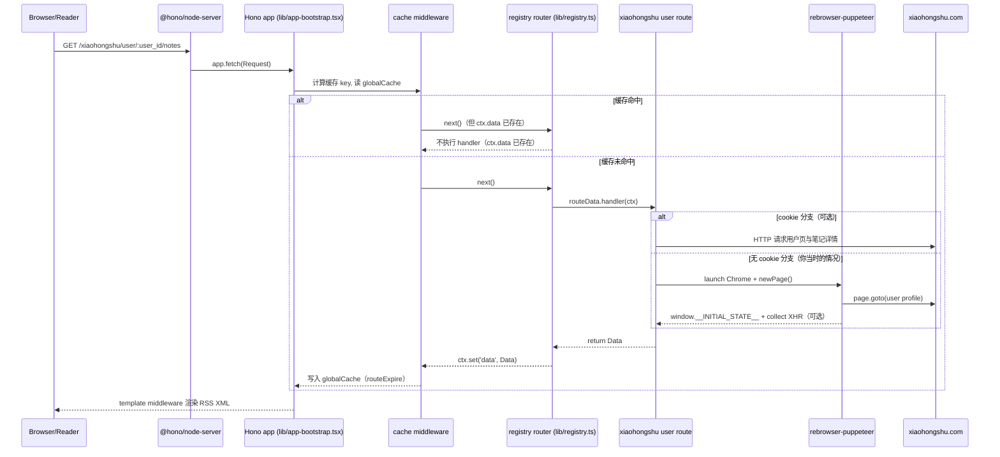

# RSSHub 请求链路说明：`/xiaohongshu/user/:user_id/notes`

本文以你访问的地址为例：

- `http://192.168.50.245:1200/xiaohongshu/user/67ebe4d6000000000e011ad1/notes`

目标是把“从浏览器发起请求 → RSSHub 服务端匹配路由 → 执行业务抓取 → 经过中间件处理 → 输出 RSS XML”的完整流程与原理串起来，并标出关键代码位置，方便后续排查与二次开发。

---

## 1. 总体时序（从浏览器到 RSS XML）

下面描述的是默认输出（不带 `?format=` 时默认 `format=rss`），并以你当时“未配置小红书 Cookie”的路径为主（因此会触发 Puppeteer）。



---

## 2. 服务端入口：HTTP 服务如何接到请求

### 2.1 `pnpm dev` 启动后做了什么

入口是 `lib/index.ts`：通过 `@hono/node-server` 的 `serve()` 启动 HTTP 服务，把 `app.fetch` 作为请求处理函数。

- `lib/index.ts:5` 引入 `serve`
- `lib/index.ts:53`-`lib/index.ts:60` 执行 `serve({ fetch: app.fetch, ... })`

### 2.2 `app` 是怎么构建出来的

`lib/app.ts` 是一个薄封装：先 import `@/utils/request-rewriter`，再 import `./app-bootstrap`。

- `lib/app.ts:1`-`lib/app.ts:5`

---

## 3. 中间件链：请求在业务 handler 前后都经历了什么

`lib/app-bootstrap.tsx` 定义了整个 Hono app，按顺序挂载中间件，然后把 `registry` 挂到根路径。

核心链路（按注册顺序）：

1. `trimTrailingSlash()`：统一处理尾部斜杠（`lib/app-bootstrap.tsx:27`）
2. `compress()`：压缩响应（`lib/app-bootstrap.tsx:28`）
3. `jsxRenderer()`：为 `ctx.render(<RSS ... />)` 提供 JSX 渲染底座（`lib/app-bootstrap.tsx:30`-`lib/app-bootstrap.tsx:35`）
4. `mLogger`：访问日志（你看到的 `info: <-- GET ...` 来自这里）（`lib/app-bootstrap.tsx:36`）
5. `trace` / `sentry` / `accessControl` / `debug`：链路追踪与调试
6. `template`：把 `ctx.get('data')` 渲染成 RSS/Atom/JSON（`lib/app-bootstrap.tsx:41`，实现见 `lib/middleware/template.tsx`）
7. `header` / `antiHotlink`：响应头与防盗链
8. `parameter`：对 `Data.item` 做统一后处理（排序、补全相对链接、清洗 HTML 等）
9. `cache`：路由级缓存（命中时不会执行 handler）
10. `registry`：真正的路由匹配与 handler 调用（`lib/app-bootstrap.tsx:47`）

### 3.1 “中间件顺序”为什么重要

Hono 中间件通常是：

```ts
const mw = async (ctx, next) => {
    // before
    await next();
    // after
};
```

因此：

- `cache` 在靠后：它能在 before 阶段先读缓存并 `ctx.set('data', ...)`，随后 registry 看到 `ctx.get('data')` 已存在就不跑 handler。
    - 缓存命中短路：`lib/middleware/cache.ts:46`-`lib/middleware/cache.ts:54`
    - registry 判断短路：`lib/registry.ts:196`-`lib/registry.ts:213`
- `template` 放在更前：它在 `await next()` 之后拿到最终 `ctx.get('data')`，再渲染成 RSS XML 输出。
    - 渲染入口：`lib/middleware/template.tsx:22`-`lib/middleware/template.tsx:128`

---

## 4. 路由注册机制：为什么 `/xiaohongshu/...` 能被匹配到

RSSHub 在开发态（`NODE_ENV=dev`）会动态扫描 `lib/routes/**` 下的 `*.ts/tsx`：

1. `lib/registry.ts` 使用 `directoryImport()` 加载 `./routes` 目录下所有模块（开发态默认分支）。
    - `lib/registry.ts:74`-`lib/registry.ts:79`
2. 每个子目录（比如 `lib/routes/xiaohongshu/`）算一个 namespace。
3. registry 会把每个 route 挂到 `/${namespace}${route.path}`：
    - `const subApp = app.basePath(\`/${namespace}\`)`：`lib/registry.ts:185`-`lib/registry.ts:187`
    - `subApp.get(path, wrappedHandler)`：`lib/registry.ts:215`

对本例而言：

- namespace = `xiaohongshu`
- route.path = `/user/:user_id/:category/:routeParams?`（见下文）
- 最终可访问路径就是：`/xiaohongshu/user/:user_id/:category/:routeParams?`

---

## 5. 本路由业务逻辑：`/xiaohongshu/user/:user_id/:category/:routeParams?`

对应文件：`lib/routes/xiaohongshu/user.ts`

### 5.1 路由路径与参数

- 路径：`lib/routes/xiaohongshu/user.ts:13`
    - `:user_id`：用户 id（例：`67ebe4d6000000000e011ad1`）
    - `:category`：`notes` 或 `collect`
    - `:routeParams?`：可选扩展参数（这里用于 `displayLivePhoto`）

### 5.2 handler 的分支（Cookie 与否）

`lib/routes/xiaohongshu/user.ts:60`-`lib/routes/xiaohongshu/user.ts:87`：

1. 取 path 参数：`userId = ctx.req.param('user_id')`，`category = ctx.req.param('category')`
2. 组装用户主页 URL：`https://www.xiaohongshu.com/user/profile/${userId}`
3. 读取配置 `config.xiaohongshu.cookie`
4. 分支：
    - cookie 存在且 `category === 'notes'`：优先走 `getUserWithCookie()` + `renderNotesFulltext()`（HTTP 抓取）
    - 否则：走 `getUserFeeds()`（Puppeteer 抓取）

### 5.3 无 Cookie 时：核心抓取链路

`getUserFeeds()`（`lib/routes/xiaohongshu/user.ts:89`-`lib/routes/xiaohongshu/user.ts:137`）会调用：

- `getUser(url, cache)`：`lib/routes/xiaohongshu/util.ts:32`

`getUser()` 做了三件事：

1. 用 `cache.tryGet(url, ...)` 做“内容缓存”（避免短时间内重复跑 Puppeteer）
2. 在缓存 miss 时启动 Puppeteer 访问用户主页，等待页面渲染出关键元素
3. 从页面里读 `window.__INITIAL_STATE__` 并返回 `{ userPageData, notes, collect }`

关键实现见：

- `lib/routes/xiaohongshu/util.ts:32`-`lib/routes/xiaohongshu/util.ts:85`

其中：

- `page.waitForSelector('div.reds-tab-item:nth-child(2), #red-captcha')`：等待页面可用或出现验证码（`lib/routes/xiaohongshu/util.ts:50`）
- `page.evaluate(() => window.__INITIAL_STATE__)`：拿到页面注入的首屏数据（`lib/routes/xiaohongshu/util.ts:56`）
- `page.click(...) + page.waitForResponse(...)`：尝试触发“收藏”请求并抓到 XHR 返回（`lib/routes/xiaohongshu/util.ts:59`-`lib/routes/xiaohongshu/util.ts:68`）

然后 `getUserFeeds()` 把这些数据拼装成 RSSHub 的 `Data`：

- `title/description/image/link/item`（`lib/routes/xiaohongshu/user.ts:96`-`lib/routes/xiaohongshu/user.ts:136`）

---

## 6. Puppeteer 原理：为什么会报 “Could not find Chrome”

### 6.1 RSSHub 怎么启动 Puppeteer

RSSHub 的 Puppeteer 工具封装在 `lib/utils/puppeteer.ts`，小红书路由通过它获取页面对象：

- `getPuppeteerPage(url, options)`：`lib/utils/puppeteer.ts:73`-`lib/utils/puppeteer.ts:195`

关键点：

1. 如果配置了 `config.puppeteerWSEndpoint`（环境变量 `PUPPETEER_WS_ENDPOINT`），会走 `puppeteer.connect()` 连接远端浏览器（`lib/utils/puppeteer.ts:135`-`lib/utils/puppeteer.ts:143`）
2. 否则走 `puppeteer.launch()` 在本机启动浏览器（`lib/utils/puppeteer.ts:144`-`lib/utils/puppeteer.ts:151`）
3. 如果配置了 `config.chromiumExecutablePath`（环境变量 `CHROMIUM_EXECUTABLE_PATH`），会把它作为 `executablePath` 传给 launch（`lib/utils/puppeteer.ts:145`-`lib/utils/puppeteer.ts:150`）
4. 启动后默认 30 秒自动 `browser.close()`（防止资源泄漏）（`lib/utils/puppeteer.ts:154`-`lib/utils/puppeteer.ts:156`）

### 6.2 为什么你一开始缺 Chrome 会 503

你当时没有设置 `CHROMIUM_EXECUTABLE_PATH`，也没配置 `PUPPETEER_WS_ENDPOINT`，于是会走：

- `rebrowser-puppeteer.launch(options)`（即 `lib/utils/puppeteer.ts:144`-`lib/utils/puppeteer.ts:151` 的默认分支）

`rebrowser-puppeteer` 属于 **core 版本**的 Puppeteer 体系：它默认不会内置浏览器二进制，需要你安装 “Chrome for Testing” 到它的缓存目录。缓存里没有对应版本时，就会在 `resolveExecutablePath` 阶段抛出：

- `Could not find Chrome (ver. 136.0.7103.49)`

RSSHub 捕获到该异常后，会在页面上展示 “Looks like something went wrong”，HTTP 返回码是 `503`（你看到的日志就是这个栈）。

### 6.3 你执行安装命令后为什么恢复正常

你执行了：

- `pnpm exec rebrowser-puppeteer browsers install chrome`

它把 `chrome@136.0.7103.49` 安装到了项目缓存目录（你实际安装输出的路径）：

- `node_modules/.cache/puppeteer/chrome/mac_arm-136.0.7103.49/chrome-mac-arm64/Google Chrome for Testing.app/Contents/MacOS/Google Chrome for Testing`

安装完成后，`rebrowser-puppeteer.launch()` 能在缓存里解析到该版本 Chrome 的可执行文件路径，于是 `getPuppeteerPage()` 可以正常启动浏览器并继续抓取，路由自然就恢复正常了。

### 6.4 相关配置项在哪里定义

RSSHub 把环境变量映射到 `config` 的位置在 `lib/config.ts`：

- `PUPPETEER_WS_ENDPOINT` → `config.puppeteerWSEndpoint`：`lib/config.ts:722`
- `CHROMIUM_EXECUTABLE_PATH` → `config.chromiumExecutablePath`：`lib/config.ts:723`

### 6.5 部署到 Vercel 后为什么又会 “找不到 Chrome”

在 Vercel Functions（Node.js runtime）里，运行环境通常**不自带**可执行的 Chrome/Chromium，也不会自动包含你本地的 Puppeteer 缓存目录，因此会出现：

- `Could not find Chrome (ver. ...)`

Vercel 官方 KB 的推荐做法是使用 `puppeteer-core` + `@sparticuz/chromium-min`（精简 Chromium，体积适配 Functions 的 bundle 限制 250MB），并在代码里显式传入 `executablePath/args/headless`，避免依赖 `~/.cache/puppeteer`。

本仓库已按同一思路做了适配（面向 RSSHub 的现有 `rebrowser-puppeteer` 封装）：

1. 在 Vercel 环境且未设置 `CHROMIUM_EXECUTABLE_PATH` 时，`lib/utils/puppeteer.ts` 会自动使用 `@sparticuz/chromium-min`：
    - 解压/落盘位置：`/tmp/chromium`
    - `headless`：`'shell'`
    - `args`：合并 `chromium.args` 与 RSSHub 原本的启动参数（包含 UA、no-sandbox 等）
2. `vercel.json` 增加 `includeFiles`，确保 `@sparticuz/chromium-min` 的二进制资源会被打包进函数部署产物，避免运行时缺文件。

---

## 7. 缓存原理：为什么同一路由多次访问会更快

RSSHub 这里其实有“两层缓存”，作用不同：

### 7.1 路由级缓存（整个 Data 缓存）

对应 `lib/middleware/cache.ts`：

- key 基于 `path + format + limit`，用 xxhash 生成短 key（`lib/middleware/cache.ts:19`-`lib/middleware/cache.ts:24`）
- 命中时直接把 JSON 反序列化到 `ctx.set('data', ...)`，并标记 `RSSHub-Cache-Status: HIT`（`lib/middleware/cache.ts:48`-`lib/middleware/cache.ts:53`）
- 未命中则执行 handler，并在返回后把 `data` 写回缓存（`lib/middleware/cache.ts:70`-`lib/middleware/cache.ts:76`）

### 7.2 内容级缓存（抓取细节缓存）

对应 `lib/utils/cache/index.ts` 的 `tryGet()`：

- `tryGet(key, getValueFunc, maxAge, refresh)`：`lib/utils/cache/index.ts:87`-`lib/utils/cache/index.ts:112`

小红书路由里用法：

- `getUser(url, cache)` 用 `cache.tryGet(url, ...)` 缓存 Puppeteer 抓到的 `initialState`（`lib/routes/xiaohongshu/util.ts:32`-`lib/routes/xiaohongshu/util.ts:85`）
- `getFullNote(link, ...)` 用 `cache.tryGet(link, ...)` 缓存单篇笔记详情页解析结果（`lib/routes/xiaohongshu/util.ts:157`-`lib/routes/xiaohongshu/util.ts:242`）

---

## 8. 最终输出：Data 如何变成 RSS XML

路由 handler 返回的是 RSSHub 的 `Data` 对象（`title/link/item/...`），并不是直接的 XML。

真正的“把 Data 转成 RSS/Atom/JSON”发生在 `lib/middleware/template.tsx`：

1. `await next()` 后读取 `ctx.get('data')`（`lib/middleware/template.tsx:22`）
2. 根据 `format` 选择输出类型（`lib/middleware/template.tsx:23`）
    - 默认 `rss`
    - `?format=atom` 输出 Atom
    - `?format=json` 输出 JSON Feed
3. `ctx.render(<RSS data={result} />)` 渲染出最终 XML（`lib/middleware/template.tsx:124`-`lib/middleware/template.tsx:127`）

同时，`parameter` 中间件会在输出前对 `Data.item` 做一轮“统一加工”（比如排序、补全相对链接、清洗控制字符等），保证最终 RSS 更稳定。

---

## 9. 常见问题与定位方式

### 9.1 404：`/xiaohongshu/user/:user_id` 访问不到

因为路由定义要求 `:category` 必填：

- `lib/routes/xiaohongshu/user.ts:13` → `/user/:user_id/:category/:routeParams?`

所以少了 `/notes` 或 `/collect` 时不会匹配该 route，最终走 `notFoundHandler`。

### 9.2 503：`Could not find Chrome`

本质是 Puppeteer 找不到可用的 Chrome。

两条解决路线：

1. 安装 Chrome for Testing 到 puppeteer 缓存（你已采用）
    - `pnpm exec rebrowser-puppeteer browsers install chrome`
2. 或者直接指定系统 Chrome
    - 设置 `CHROMIUM_EXECUTABLE_PATH` 指向你机器上 Chrome 可执行文件（见上文）

### 9.3 `CaptchaError`

小红书页面出现 `#red-captcha` 时会抛出 Captcha 错误：

- `lib/routes/xiaohongshu/util.ts:52`-`lib/routes/xiaohongshu/util.ts:54`

通常意味着触发风控，需要更换网络环境、降低抓取频率或使用可用 cookie。

---

## 10. 你这次现象的“因果链”总结

1. 你访问 `/xiaohongshu/user/.../notes` 命中小红书路由（registry 负责匹配）。
2. 路由在无 cookie 时会调用 `getPuppeteerPage()` 启动浏览器抓 `__INITIAL_STATE__`。
3. 你本地当时没有安装 puppeteer 需要的 Chrome for Testing，且没有配置 `CHROMIUM_EXECUTABLE_PATH` 或 `PUPPETEER_WS_ENDPOINT`。
4. 所以 `rebrowser-puppeteer.launch()` 在解析浏览器路径阶段抛错，RSSHub 返回 503。
5. 你安装了 `chrome@136.0.7103.49` 到 `node_modules/.cache/puppeteer` 后，launch 能找到 Chrome，路由恢复正常。
